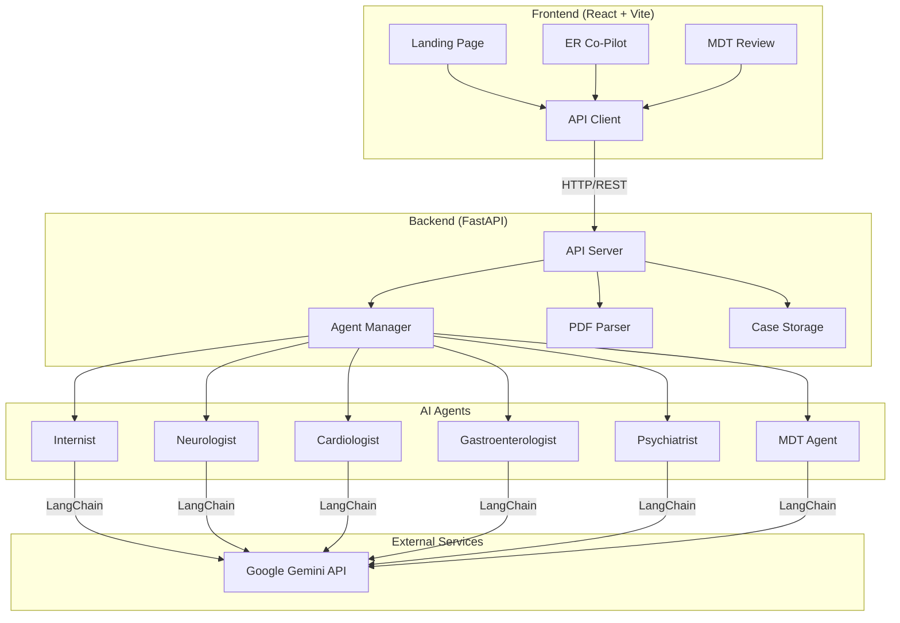
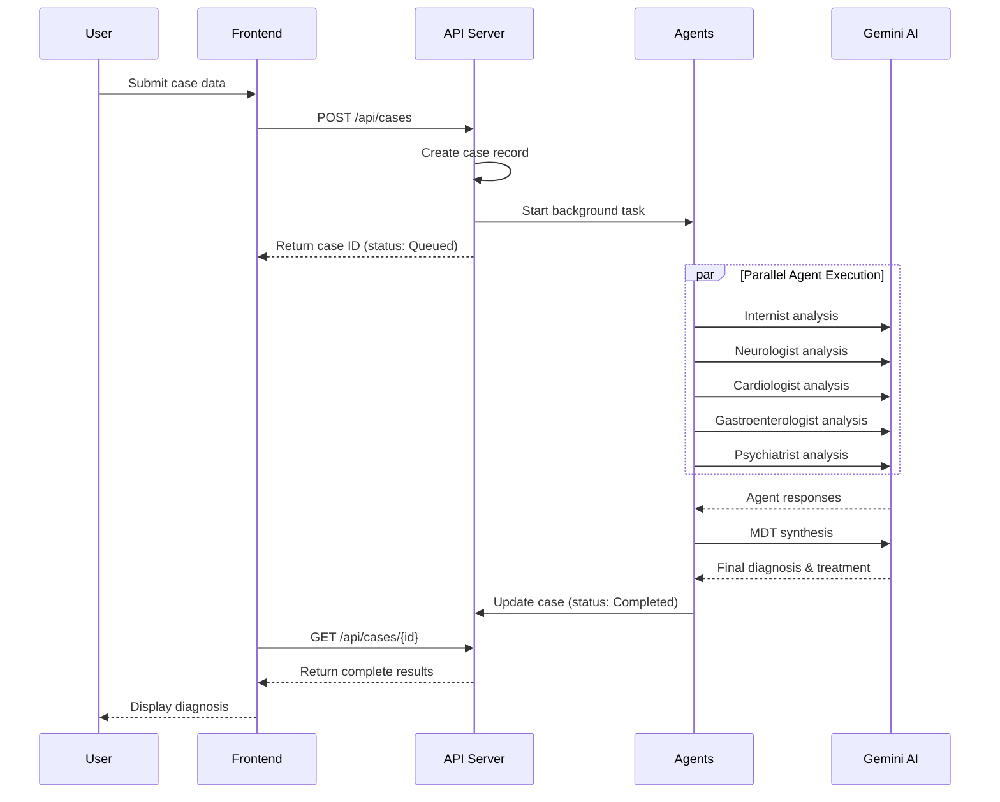
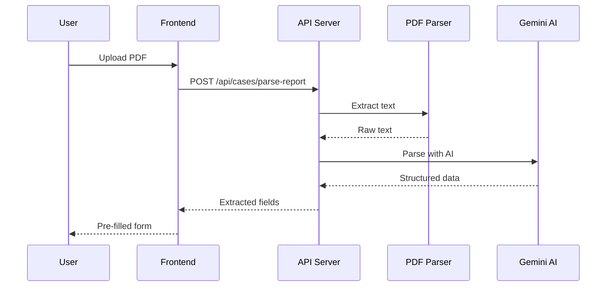

# MedAura AI - System Architecture

## Overview

MedAura AI is a multi-agent medical diagnostics platform that uses AI to simulate a multidisciplinary medical team. This document describes the system architecture, component interactions, and data flow.

## High-Level Architecture



## Component Details

### Frontend

| Component | Technology | Purpose |
|-----------|------------|---------|
| Landing Page | React | Marketing and product introduction |
| ER Co-Pilot | React | Emergency room case intake and triage |
| MDT Review | React | Multidisciplinary team case review |
| API Client | Fetch API | Backend communication |

### Backend

| Component | Technology | Purpose |
|-----------|------------|---------|
| API Server | FastAPI | RESTful API endpoints |
| Agent Manager | Python | Orchestrates AI agent execution |
| PDF Parser | pdfplumber | Extracts text from medical PDFs |
| Case Storage | JSON Files | Persists case data (filesystem) |

### AI Agents

Each agent is implemented using LangChain with Google Gemini as the LLM:

| Agent | Specialty | Output |
|-------|-----------|--------|
| Internist | General medicine | Initial assessment, systemic review |
| Neurologist | Neurology | Neurological findings, cognitive assessment |
| Cardiologist | Cardiology | Cardiovascular assessment |
| Gastroenterologist | GI | Digestive system assessment |
| Psychiatrist | Mental Health | Psychological assessment |
| MDT Agent | Synthesis | Final diagnosis, treatment recommendations |

## Data Flow

### Case Creation Flow



### PDF Upload Flow



## Technology Stack

### Backend
- **Python 3.9+**: Core runtime
- **FastAPI**: Web framework
- **LangChain**: AI orchestration
- **Google Gemini**: Large language model
- **pdfplumber**: PDF text extraction
- **uvicorn**: ASGI server

### Frontend
- **React 18**: UI framework
- **Vite**: Build tool
- **React Router**: Navigation
- **Framer Motion**: Animations
- **Three.js**: 3D effects (optional)

### DevOps
- **Docker**: Containerization
- **Docker Compose**: Multi-container orchestration
- **GitHub Actions**: CI/CD
- **NGINX**: Frontend static serving (production)

## Directory Structure

```
MedAura-AI/
├── api_server.py          # FastAPI application
├── Main.py                # Standalone CLI script
├── requirements.txt       # Python dependencies
├── Dockerfile             # Backend container
├── docker-compose.yml     # Multi-container setup
│
├── Utils/
│   └── Agents.py          # AI agent implementations
│
├── frontend/
│   ├── src/
│   │   ├── components/    # React components
│   │   ├── api/           # API client
│   │   ├── hooks/         # Custom React hooks
│   │   └── App.jsx        # Main application
│   ├── Dockerfile         # Frontend container
│   └── package.json       # Node dependencies
│
├── docs/                  # Documentation
├── scripts/               # Utility scripts
└── .github/               # GitHub workflows
```

## Security Considerations

1. **API Keys**: Stored in environment variables, never in code
2. **CORS**: Configured for allowed origins only
3. **Input Validation**: Pydantic models validate all input
4. **Medical Disclaimer**: AI outputs are for informational purposes only

## Scaling Considerations

- **Horizontal Scaling**: Stateless backend can run multiple instances
- **Database**: JSON files should be replaced with PostgreSQL for production
- **Caching**: Consider Redis for frequently accessed data
- **Rate Limiting**: Implement at API gateway level
